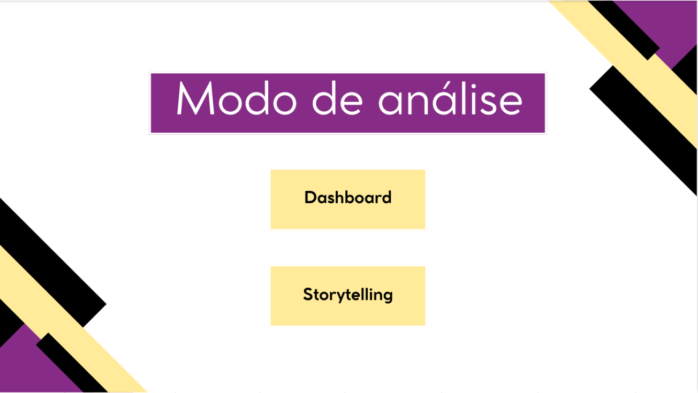

# 🔐 Análise de Ameaças Cibernéticas (2015–2024) | Python + Power BI

Este projeto apresenta uma análise exploratória de ameaças cibernéticas entre 2015 e 2024, utilizando um dataset público do Kaggle.

O objetivo foi transformar dados brutos em narrativas visuais estratégicas, combinando tratamento de dados em Python com visualizações interativas no Power BI, aplicando técnicas de storytelling analítico.

---

## 🔍 Objetivo

- Organizar e estruturar dados históricos de segurança digital  
- Identificar padrões e tendências ao longo dos anos  
- Analisar impactos financeiros relacionados a incidentes  
- Criar dashboards com foco em interpretação executiva  
- Aplicar storytelling para facilitar a tomada de decisão  

---

## 🔄 Processo de Desenvolvimento (ETL)

O projeto iniciou com um processo estruturado de ETL utilizando Python:

### 🧹 Tratamento e Transformação

- Limpeza de dados inconsistentes  
- Padronização de categorias  
- Tradução de variáveis  
- Conversão de valores financeiros  
- Tratamento de dados temporais  
- Estruturação para modelagem analítica  

Bibliotecas utilizadas:

- Pandas  
- NumPy  

---

## 📊 Estrutura do Dashboard

O dashboard foi construído para responder perguntas estratégicas relacionadas à segurança digital.

### 📈 Visão Temporal

- Evolução de incidentes ao longo dos anos  
- Tendência de crescimento ou redução de ameaças  
- Distribuição por tipo de ataque  

### 💰 Impacto Financeiro

- Estimativa de prejuízos ao longo do tempo  
- Comparação entre tipos de incidentes  
- Análise de impacto econômico por categoria  

### 🔎 Análise Comparativa

- Frequência por setor afetado  
- Distribuição geográfica  
- Classificação por nível de severidade  

---

## 🧠 Storytelling Aplicado

O diferencial deste projeto foi a aplicação de storytelling em algumas páginas do relatório.

Os dashboards foram estruturados para:

- Guiar o usuário pela narrativa dos dados  
- Responder perguntas estratégicas de segurança  
- Destacar insights relevantes  
- Facilitar leitura executiva  

A organização visual foi pensada para transformar dados técnicos em informação acessível.

---

## 📈 Métricas e Indicadores Criados

- Total de incidentes por ano  
- Crescimento percentual anual  
- Prejuízo financeiro acumulado  
- Incidentes por categoria  
- Incidentes por setor  

---

## 🛠️ Tecnologias Utilizadas

- Python  
  - Pandas  
  - NumPy  
- Power BI  
- DAX (Data Analysis Expressions)  
- Modelagem de Dados  

---

## 🎯 Competências Aplicadas

- ETL e organização de bases de dados  
- Tratamento de dados temporais e financeiros  
- Padronização e transformação de informações  
- Modelagem analítica  
- Criação de dashboards executivos  
- Storytelling com dados  
- Comunicação de insights estratégicos  

---

## 📷 Preview 

## 📁 Arquivo 
O arquivo .pbix está disponível na pasta Arquivos/.

## 📬 Contato 
Caso queira saber mais ou colaborar, entre em contato pelo [LinkedIn](http://www.linkedin.com/in/ana-beatriz-marques-ferreira-42125121a)
